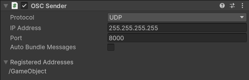
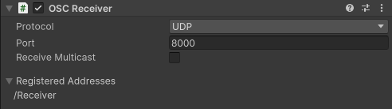
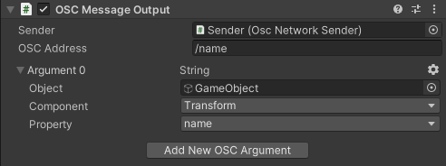
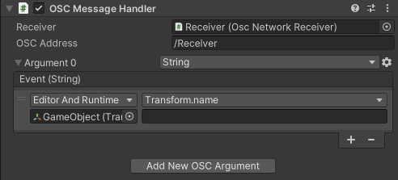
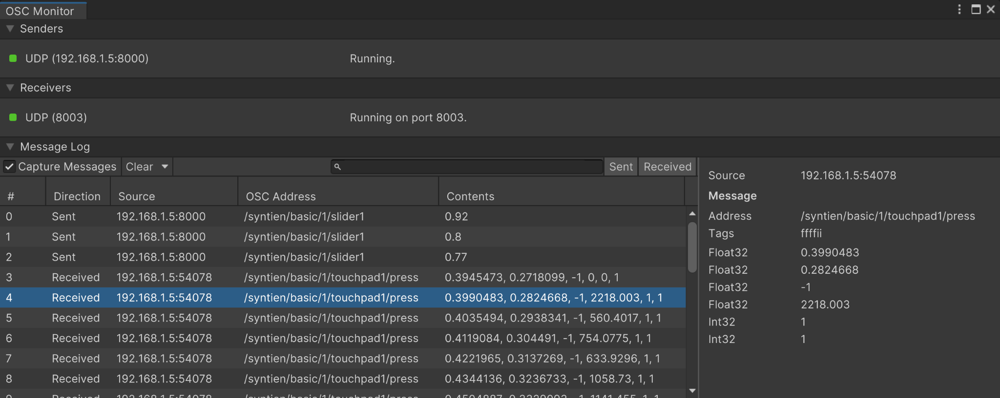

[Contents](TableOfContents.md) | [Home](index.md) > Interface reference

# Interface reference

Components:

- [OSC Sender](#osc-sender)

- [OSC Receiver](#osc-receiver)

- [OSC Message Output](#osc-message-output)

- [OSC Message Handler](#osc-message-handler)

Window:

- [OSC Monitor](#osc-monitor)

## OSC Sender

Use the OSC Sender component to enable and configure a local client that sends OSC messages from your Unity project to an external OSC capable device or application over the network.

**Note:** To get OSC messages to send through the OSC Sender, you also need to set up one or multiple [OSC Message Output](#osc-message-output) components in your Unity project.

| **Property** | **Description** |
|:---|:---|
| **Protocol** | The network protocol to send the OSC messages with. Select UDP or TCP. |
| **Stream Type** | Select the type of stream to use in the message header (TCP only): SLIP or Length Prefix. |
| **IP Address** | The destination IP address to send the OSC messages to. |
| **Port** | The local port to send the OSC messages on. |
| **Auto Bundle Messages** | Automatically groups OSC messages into bundles to help reduce network overload.  **Note:** The receiving device or application must support OSC bundles. |
| **Registered Addresses** | The OSC addresses of the messages this sender may output. |

## OSC Receiver

Use the OSC Receiver component to enable and configure a local server that listens for OSC messages sent to your Unity workstation from external devices or applications over the network.

**Note:** To address and process the OSC messages received through the OSC Receiver, you also need to set up one or multiple [OSC Message
Handler](#osc-message-handler) components in your Unity project.

| **Property** | **Description** |
|:---|:---|
| **Protocol** | The network protocol to receive incoming OSC messages with. Select UDP or TCP. |
| **Stream Type** | Select the type of stream to use in the message header (TCP only): SLIP or Length Prefix. |
| **Port** | The local port on which to listen for incoming OSC messages. |
| **Receive Multicast** | Enables the reception of OSC messages sent via [UDP multicast](https://en.wikipedia.org/wiki/IP_multicast). |
| **IP Address** | The IP address of the multicast group to join. |
| **Loopback** | Enable the reception of multicast messages sent out by the local device. |
| **Registered Addresses** | The OSC addresses this receiver handles. |

## OSC Message Output

Use the OSC Message Output component to generate OSC messages from GameObject properties of your Unity project.

**Note:** To send the generated OSC messages to an external OSC capable device or application over the network, you also need to set up an [OSC Sender](#osc-sender) component in your Unity project.

| **Property** | **Description** |
|:---|:---|
| **Sender** | The OSC Network Sender to send messages with. |
| **OSC Address** | The OSC Address Pattern of the output messages. |
| **Argument n** | Adds one or more OSC type tags and any corresponding data to the constructed OSC messages. |
| **Add New OSC Argument** | Adds a new argument to the constructed OSC messages. |

### Argument properties and options

| **Property** | **Description** |
|:---|:---|
| **Object** | The GameObject with the component the argument sources data from. |
| **Component** | The component the argument sources data from. |
| **Property** | The field, property, or method of the component that provides the message data. |

## OSC Message Handler

Use the OSC Message Handler component to process received OSC messages as events controlling GameObject properties of your Unity project.

**Note:** To receive OSC messages sent from external devices or applications over the network, you also need to set up an [OSC Receiver](#osc-receiver) component in your Unity project.

| **Property** | **Description** |
|:---|:---|
| **Receiver** | The OSC Network Receiver to handle messages from. |
| **OSC Address** | The OSC Address Pattern to associate with this message handler. |
| **Argument n** | Reads a message argument consisting of one or more OSC type tags and any corresponding data from received OSC messages. |
| **Add New OSC Argument** | Adds a new argument to read from received OSC messages. |

### Argument properties and options

| **Property** | **Description** |
|:---|:---|
| Type selector | The type of the data this argument reads from received OSC messages. |
| Gear icon | Opens a menu to reorder or remove arguments. |
| Event | The event callbacks invoked when this argument is read from a received OSC message. |

## OSC Monitor

Use the OSC Monitor to get the current OSC configuration status in your project and view the list and details of all sent and received OSC messages.

To open the OSC Monitor window: from the Unity Editor main menu, select **Window \> Analysis \> OSC Monitor.**

### Senders

This section lists all OSC Senders currently set up and active in your project, with status and network configuration info (transport protocol and IP address/port of the targeted OSC device).

### Receivers

This section lists all OSC Receivers currently set up and active in your project, with their status and network configuration info (transport protocol and local listening port).

### Message Log

The Message Log allows you to view the list and details of the OSC messages your Unity project sends and receives.

| **Control** | **Description** |
|:---|:---|
| **Capture Messages** | Enables or disables the capture of incoming and outgoing OSC messages to log them in the list below. |
| **Clear** | Permanently clears all messages from the list. Use the **Clear on Play** option in the dropdown list besides this button to make Unity clear the list or not when you enter Play mode. |
| *Search field* | Enter text to match values in the **OSC Address** or **Contents** columns. |
| **Sent** | Hides or displays all sent messages of the list. |
| **Receive** | Hides or displays all received messages of the list. |

| **Column** | **Description** |
|:---|:---|
| **\#** | The ordering number of the message, according to the current listed messages and the order in which Unity captured them. Click on this column header to change the order of the list. |
| **Direction** | Indicates message direction: sent or received. |
| **Source** | For messages sent by UDP or TCP, shows the IP address and port the message was received from or sent to. |
| **OSC Address** | The OSC address used to route the message and map it to an event at its destination. |
| **Contents** | The data values transported in the message. |
| *Right panel* | Displays all the message details of the OSC message currently selected in the list. **Tip:** Use this panel to select and copy any value in the message content if needed, for example an OSC address received from a remote device. |
